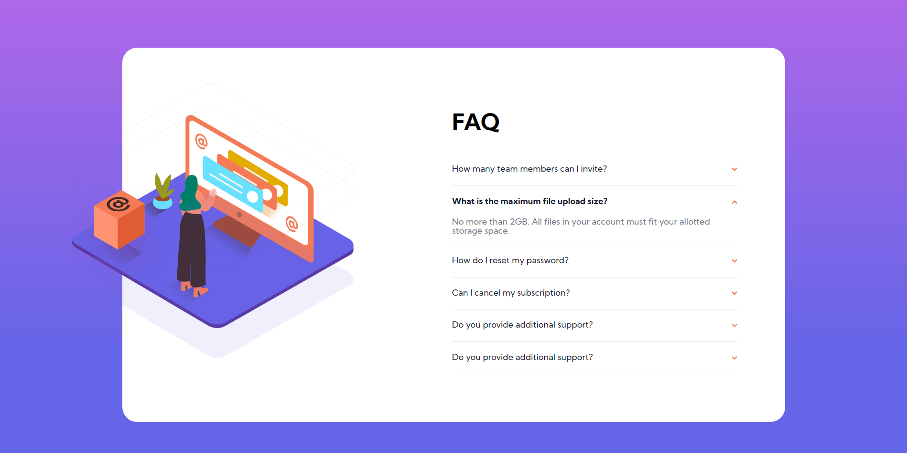

# Frontend Mentor - FAQ accordion card solution

This is a solution to the [FAQ accordion card challenge on Frontend Mentor](https://www.frontendmentor.io/challenges/faq-accordion-card-XlyjD0Oam). Frontend Mentor challenges help you improve your coding skills by building realistic projects.

## Table of contents

- [Overview](#overview)
  - [The challenge](#the-challenge)
  - [Screenshot](#screenshot)
  - [Links](#links)
- [My process](#my-process)
  - [Built with](#built-with)
  - [What I learned](#what-i-learned)
  - [Continued development](#continued-development)
  - [Useful resources](#useful-resources)
- [Author](#author)
- [Acknowledgments](#acknowledgments)

## Overview

### The challenge

Users should be able to:

- View the optimal layout for the component depending on their device's screen size
- See hover states for all interactive elements on the page
- Hide/Show the answer to a question when the question is clicked

### Screenshot




### Links

- Solution URL: [Final Solution](https://www.frontendmentor.io/solutions/faq-accordion-card-with-react-styled-component-animation-xHMGlFIeE)
- Live Site URL: [Live Server](https://faqaccordioncardku.netlify.app/)

## My process

### Built with

- Semantic HTML5 markup
- CSS custom properties
- Flexbox
- CSS Grid
- Mobile-first workflow
- [React](https://reactjs.org/) - JS library
- [Styled Components](https://styled-components.com/) - For styles

### What I learned

```css
@keyframes updown {
      from {
        transform: translateY(0);
      }
      to {
        transform: translateY(-20px);
      }
    }
    .box {
      ...
      animation-duration: 1s;
      animation-name: updown;
      animation-iteration-count: infinite;
      animation-direction: alternate;
      ...
    }
```

### Continued development

for next i planing to add more simple animation and learn about keyframes

### Useful resources

- [w3school](https://www.w3schools.com/) - This helped me for guide with html, help to change pic when size change, etc.
- [flexbox malven](https://flexbox.malven.co/) - This is an amazing guide for referance when using flexboc. I'd recommend it to anyone still learning this concept.
- [css-trick](https://css-tricks.com/) - best article about css

## Author

- Website - [Aldi Anugra](https://github.com/LordAldi)
- Frontend Mentor - [@LordAldi](https://www.frontendmentor.io/profile/LordAldi)
- Instgram - [@aldi_anu](https://www.instagram.com/aldi_anu/)
- LinkedIn - [Aldi Anugra](https://www.linkedin.com/in/aldi-anugra-333132199/)
